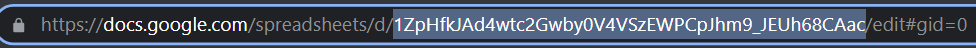

#Для начала работы

##Краткое руководство
Скачайте проект, установите зависимости, настройте файл ./app/SETTINGS.py запустите приложение `app/app.py`, настройте свой сервер и запустите `web_app/backend/web_app.py`

##Подробное руководство

1. Скачайте проект `git clone `


2. Создайте виртуальное окружение и установите `requirements.txt`


3. Скачайте файл `credentials.json` в [панели разработчика Google API](https://console.cloud.google.com/cloud-resource-manager),
 и укажите путь до файла в SETTINGS.py (CREDENTIALS_PATH).
    ```
    # Путь до файла
    CREDENTIALS_PATH = r'Путь до файла'
    ```

    
2. Скопируйте id из ссылки на таблицу и вставьте в SETTINGS.py (SPREADSHEET_ID).
     
    
    


3. Укажите название листа в SETTINGS.py (LIST_NAME)


4. Настройте данные для подключения к PostgreSQL в
 SETTINGS.py
    ```
    DATABASE = {
        'drivername': 'postgresql',
        'host': '127.0.0.1',
        'port': '5432',
        'username': 'postgres',
        'password': '1111',
        'database': 'orders_info'
    }
    ```

5. Укажите частоту обновления данных в SETTINGS.py в секундах (UPDATE_TIME_SECOND)


6. Укажите курс доллара по умолчанию в SETTINGS.py (DOLLAR_CURRENCY), если сервер ЦБ РФ будет недоступен.


7. Создайте бота и напишите ему со всех аккаутнов, на которые будут направляться отчёты о просрочке поставок, затем получите токен у BotFather и вставьте его в SETTINGS.py (TELEGRAM_BOT_TOKEN)


8. Получите id каждого пользователя в боте @getmyid_bot, которым хотите рассылать оповещение о просрочке поставок и вставьте их в SETTINGS.py в виде списка:

   Если один пользователь:
    ```
    TELEGRAM_USER_IDS = ["835655349"]
    ```
   Если несколько пользователей:
    ```
    TELEGRAM_USER_IDS = ["835655349", "324555349", "324675349"]
    ```

9. Запустите скрипт `app.py` и добавьте скрипты в автозагрузку, это основной скрипт, он отправляет сообщения о просрочке и связывает БД с Google sheets


10. Настройте сервер WSGI и запустите `web_app.py` приложение


Все логи по ошибкам находятся в app_logs.log